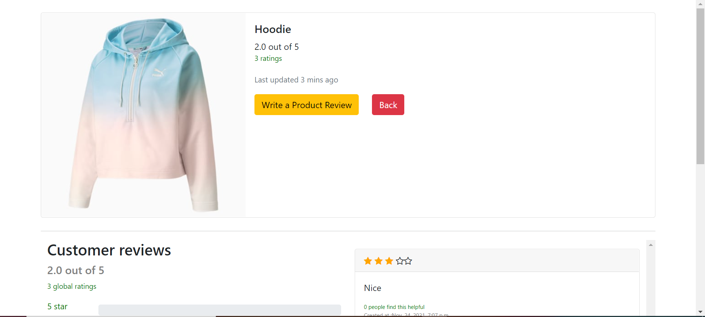

Thie Review Application is a problem given on gumRoad which i picked so to learn javascript , python and Django . 
You can find this problem on following Url :https://gumroad.notion.site/Coding-challenge-f7aa85150edd41eeb3537aae4632619f
Essentially this is a reviewing utility where admin can add number of products and user can rate and comment on these given products .

Index Page where all the products are listed with there average rating calculated.

In detail page of each product a user can rate and comment , see chart for percetage of rating in each start , total ratings done till now . 

